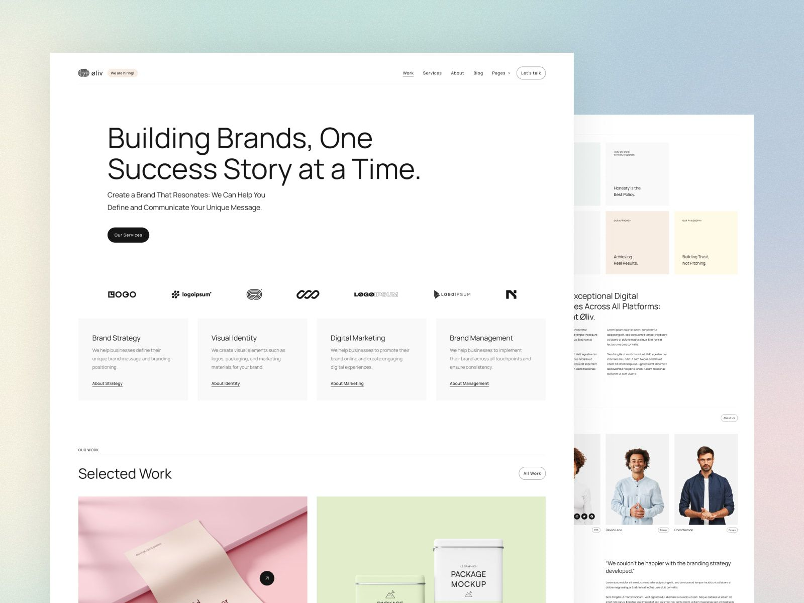

# Oliv - Agency & Portfolio Astro + Framer Template

**Hi everyone!** I'm Adrian Lambrese, a Frontend Web Developer specializing in creating client-first components. For this project, I took the [Oliv Template](https://oliv-template.framer.website/?via=pawelgola) from Framer and recreated the components, styles, and structure as closely as possible with **Astro** framework.

If you like the template, consider visiting the author's page: [Pawel Gola](https://gola.lemonsqueezy.com/).

Framer Template https://oliv-template.framer.website


Github Repository https://github.com/adrixvoid/oliv
Live Preview https://oliv-sepia.vercel.app/


## How to run 🚀

```sh
npm install
```

then run development mode

```
npm run dev
```

## 🧞 Commands

All commands are run from the root of the project, from a terminal:

| Command                   | Action                                           |
| :------------------------ | :----------------------------------------------- |
| `npm install`             | Installs dependencies                            |
| `npm run dev`             | Starts local dev server at `localhost:4321`      |
| `npm run build`           | Build your production site to `./dist/`          |
| `npm run preview`         | Preview your build locally, before deploying     |
| `npm run astro ...`       | Run CLI commands like `astro add`, `astro check` |
| `npm run astro -- --help` | Get help using the Astro CLI                     |

## 👀 Want to know more?

Feel free to contact me [Linkedin](https://www.linkedin.com/in/adrian-lambrese) or [Twitter / X](https://x.com/adrixvoid).
